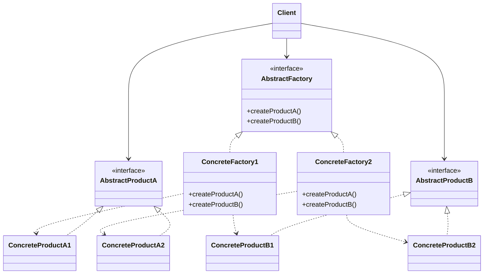

# Abstract Factory Design Pattern: A Comprehensive Guide

## Table of Contents
- [Introduction](#introduction)
- [Basic Concepts](#basic-concepts)
- [Structure](#structure)
- [Implementation](#implementation)
- [Advantages](#advantages)
- [Disadvantages](#disadvantages)
- [Real-world Examples](#real-world-examples)
- [Advanced Concepts](#advanced-concepts)
- [Best Practices](#best-practices)
- [Comparison with Other Patterns](#comparison-with-other-patterns)
- [Code Examples](#code-examples)
- [Variations](#variations)
- [Testing Considerations](#testing-considerations)
- [Performance Implications](#performance-implications)
- [Conclusion](#conclusion)

## Introduction

The Abstract Factory is a creational design pattern that provides an interface for creating families of related or dependent objects without specifying their concrete classes. It's often referred to as a "factory of factories" or a "super factory."

This pattern is crucial when a system needs to be independent of how its products are created, composed, and represented, and when families of related product objects are designed to be used together. It promotes loose coupling between client code and concrete implementations, making it easier to extend and maintain complex systems.

## Basic Concepts

1. **Abstract Factory**: An interface that declares a set of methods for creating abstract products.
   - Why it's important: It defines the contract for creating product families, allowing clients to work with any concrete factory without coupling to specific classes.

2. **Concrete Factory**: Implements the Abstract Factory interface to create concrete product objects.
   - Why it's important: It provides the actual implementation for creating a family of related products, ensuring they are compatible with each other.

3. **Abstract Product**: Declares an interface for a type of product object.
   - Why it's important: It defines the common interface for a type of product, allowing clients to use products without knowing their specific classes.

4. **Concrete Product**: Implements the Abstract Product interface to create a specific product object.
   - Why it's important: It provides the actual implementation of a product, tailored for a specific variant or family.

5. **Client**: Uses the Abstract Factory and Abstract Product interfaces to create a family of related objects.
   - Why it's important: It works with factories and products only through their abstract interfaces, allowing for easy substitution of concrete factories and products.

Example of basic concepts:

```java
// Abstract Factory
public interface GUIFactory {
    Button createButton();
    Checkbox createCheckbox();
}

// Concrete Factory
public class WindowsGUIFactory implements GUIFactory {
    @Override
    public Button createButton() {
        return new WindowsButton();
    }

    @Override
    public Checkbox createCheckbox() {
        return new WindowsCheckbox();
    }
}

// Abstract Product
public interface Button {
    void paint();
}

// Concrete Product
public class WindowsButton implements Button {
    @Override
    public void paint() {
        System.out.println("Render a button in Windows style");
    }
}

// Client
public class Application {
    private GUIFactory factory;
    private Button button;

    public Application(GUIFactory factory) {
        this.factory = factory;
    }

    public void createUI() {
        this.button = factory.createButton();
    }

    public void paint() {
        button.paint();
    }
}
```

## Structure

The structure of the Abstract Factory pattern typically includes:

1. Abstract Factory
2. Concrete Factories
3. Abstract Products
4. Concrete Products
5. Client

Why this structure is important:
- It separates the creation of objects from their use, allowing the system to be independent of how its objects are created.
- It makes it easy to interchange concrete factories, which facilitates switching between product families.
- It promotes consistency among products, as a factory is responsible for creating an entire family of products.

Here's a diagram illustrating the structure:



## Implementation

To implement the Abstract Factory pattern:

1. Identify the families of related products.
   - Why: This step helps you understand the scope of the pattern application and define clear boundaries between product families.

2. Create abstract interfaces for each product type.
   - Why: Abstract interfaces allow clients to work with products without knowing their concrete classes, promoting loose coupling.

3. Create an abstract factory interface that declares creation methods for each abstract product.
   - Why: This interface defines the contract for creating families of related products, enabling easy substitution of entire product families.

4. Implement concrete factories for each product family.
   - Why: Concrete factories provide the actual implementation for creating a specific family of related products, ensuring their compatibility.

5. Create concrete product classes that implement the abstract product interfaces.
   - Why: These classes provide the actual implementation of products, tailored for specific variants or families.

6. In the client code, use the abstract factory to create products.
   - Why: This allows the client to work with any concrete factory without coupling to specific classes, making the system more flexible and extensible.

Example implementation:

```java
// Step 1: Identify product families (e.g., Button, Checkbox)

// Step 2: Create abstract product interfaces
public interface Button {
    void paint();
}

public interface Checkbox {
    void paint();
}

// Step 3: Create abstract factory interface
public interface GUIFactory {
    Button createButton();
    Checkbox createCheckbox();
}

// Step 4: Implement concrete factories
public class WindowsGUIFactory implements GUIFactory {
    @Override
    public Button createButton() {
        return new WindowsButton();
    }

    @Override
    public Checkbox createCheckbox() {
        return new WindowsCheckbox();
    }
}

public class MacGUIFactory implements GUIFactory {
    @Override
    public Button createButton() {
        return new MacButton();
    }

    @Override
    public Checkbox createCheckbox() {
        return new MacCheckbox();
    }
}

// Step 5: Create concrete product classes
public class WindowsButton implements Button {
    @Override
    public void paint() {
        System.out.println("Render a button in Windows style");
    }
}

public class MacButton implements Button {
    @Override
    public void paint() {
        System.out.println("Render a button in Mac style");
    }
}

public class WindowsCheckbox implements Checkbox {
    @Override
    public void paint() {
        System.out.println("Render a checkbox in Windows style");
    }
}

public class MacCheckbox implements Checkbox {
    @Override
    public void paint() {
        System.out.println("Render a checkbox in Mac style");
    }
}

// Step 6: Use the abstract factory in client code
public class Application {
    private GUIFactory factory;
    private Button button;
    private Checkbox checkbox;

    public Application(GUIFactory factory) {
        this.factory = factory;
    }

    public void createUI() {
        this.button = factory.createButton();
        this.checkbox = factory.createCheckbox();
    }

    public void paint() {
        button.paint();
        checkbox.paint();
    }
}

// Usage
public class Main {
    public static void main(String[] args) {
        Application windowsApp = new Application(new WindowsGUIFactory());
        windowsApp.createUI();
        windowsApp.paint();

        Application macApp = new Application(new MacGUIFactory());
        macApp.createUI();
        macApp.paint();
    }
}
```

## Advantages

1. **Isolation of concrete classes**: The pattern helps you control the classes of objects that an application creates.
   - Why it's important: It reduces dependencies on concrete implementations, making the system more modular and easier to maintain.

2. **Exchanging product families**: The concrete factory can be easily replaced with another concrete factory.
   - Why it's important: It allows for easy switching between different product families, enhancing flexibility and adaptability of the system.

3. **Promoting consistency**: When products from a family are designed to work together, the Abstract Factory makes it easy to use objects from only one family at a time.
   - Why it's important: It ensures that compatible products are used together, reducing errors and improving system reliability.

4. **Single Responsibility Principle**: You can extract the product creation code into one place, making the code easier to support.
   - Why it's important: It improves code organization and makes the system easier to maintain and extend.

5. **Open/Closed Principle**: You can introduce new variants of products without breaking existing client code.
   - Why it's important: It allows for easy extension of the system with new product variants without modifying existing code.

Example demonstrating advantages:

```java
// Existing code remains unchanged

// Adding a new product family for Linux
public class LinuxGUIFactory implements GUIFactory {
    @Override
    public Button createButton() {
        return new LinuxButton();
    }

    @Override
    public Checkbox createCheckbox() {
        return new LinuxCheckbox();
    }
}

public class LinuxButton implements Button {
    @Override
    public void paint() {
        System.out.println("Render a button in Linux style");
    }
}

public class LinuxCheckbox implements Checkbox {
    @Override
    public void paint() {
        System.out.println("Render a checkbox in Linux style");
    }
}

// Client code remains unchanged, but can now use LinuxGUIFactory
public class Main {
    public static void main(String[] args) {
        Application linuxApp = new Application(new LinuxGUIFactory());
        linuxApp.createUI();
        linuxApp.paint();
    }
}
```

## Disadvantages

1. **Complexity**: The code becomes more complicated since many new interfaces and classes are introduced along with the pattern.
   - Why it's a concern: Increased complexity can make the codebase harder to understand and maintain, especially for smaller projects.

2. **Difficulty in adding new products**: To add a new product, you might need to change the Abstract Factory interface and all of its implementations.
   - Why it's a concern: It can violate the Open/Closed Principle if new product types need to be added frequently.

3. **Dependency on interfaces**: The pattern assumes that a product family will never need to add new product types.
   - Why it's a concern: It can be inflexible if the product families need to evolve independently.

Example illustrating disadvantages:

```java
// Adding a new product type (e.g., Slider) requires changing multiple interfaces and classes

public interface GUIFactory {
    Button createButton();
    Checkbox createCheckbox();
    Slider createSlider(); // New method
}

public class WindowsGUIFactory implements GUIFactory {
    // ... existing methods ...
    @Override
    public Slider createSlider() {
        return new WindowsSlider();
    }
}

public class MacGUIFactory implements GUIFactory {
    // ... existing methods ...
    @Override
    public Slider createSlider() {
        return new MacSlider();
    }
}

public interface Slider {
    void paint();
}

public class WindowsSlider implements Slider {
    @Override
    public void paint() {
        System.out.println("Render a slider in Windows style");
    }
}

public class MacSlider implements Slider {
    @Override
    public void paint() {
        System.out.println("Render a slider in Mac style");
    }
}

// Client code needs to be updated to use the new product
public class Application {
    // ... existing fields ...
    private Slider slider;

    public void createUI() {
        // ... existing code ...
        this.slider = factory.createSlider();
    }

    public void paint() {
        // ... existing code ...
        slider.paint();
    }
}
```

## Real-world Examples

1. **Cross-platform UI toolkits**: Creating UI elements (buttons, checkboxes, menus) that look native on different operating systems.
   - Why it's useful: It allows developers to create applications with consistent UI across different platforms without changing the core application logic.

2. **Database access**: Creating database connections and query objects for different database systems.
   - Why it's useful: It enables applications to work with multiple database systems without changing the data access code.

3. **Vehicle manufacturing**: Creating different types of vehicles (cars, trucks, motorcycles) with different configurations for different markets.
   - Why it's useful: It allows for the creation of vehicles with consistent parts and configurations for specific markets or regulations.

Example of database access using Abstract Factory:

```java
// Abstract Products
public interface Connection {
    void connect();
}

public interface Statement {
    void execute(String query);
}

// Abstract Factory
public interface DatabaseFactory {
    Connection createConnection();
    Statement createStatement();
}

// Concrete Products for MySQL
public class MySQLConnection implements Connection {
    @Override
    public void connect() {
        System.out.println("Connected to MySQL database");
    }
}

public class MySQLStatement implements Statement {
    @Override
    public void execute(String query) {
        System.out.println("Executing MySQL query: " + query);
    }
}

// Concrete Products for PostgreSQL
public class PostgreSQLConnection implements Connection {
    @Override
    public void connect() {
        System.out.println("Connected to PostgreSQL database");
    }
}

public class PostgreSQLStatement implements Statement {
    @Override
    public void execute(String query) {
        System.out.println("Executing PostgreSQL query: " + query);
    }
}

// Concrete Factories
public class MySQLFactory implements DatabaseFactory {
    @Override
    public Connection createConnection() {
        return new MySQLConnection();
    }

    @Override
    public Statement createStatement() {
        return new MySQLStatement();
    }
}

public class PostgreSQLFactory implements DatabaseFactory {
    @Override
    public Connection createConnection() {
        return new PostgreSQLConnection();
    }

    @Override
    public Statement createStatement() {
        return new PostgreSQLStatement();
    }
}

// Client
public class DatabaseClient {
    private DatabaseFactory factory;
    private Connection connection;
    private Statement statement;

    public DatabaseClient(DatabaseFactory factory) {
        this.factory = factory;
        this.connection = factory.createConnection();
        this.statement = factory.createStatement();
    }

    public void executeQuery(String query) {
        connection.connect();
        statement.execute(query);
    }
}

// Usage
public class Main {
    public static void main(String[] args) {
        DatabaseClient mysqlClient = new DatabaseClient(new MySQLFactory());
        mysqlClient.executeQuery("SELECT * FROM users");

        DatabaseClient  postgresClient = new DatabaseClient(new PostgreSQLFactory());
        postgresClient.executeQuery("SELECT * FROM products");
    }
}
```

## Advanced Concepts

1. **Parameterized Factory**: Using a parameter to determine which concrete factory to use.
   - Why it's useful: It allows for dynamic selection of factories based on runtime conditions.

2. **Factory of Factories**: Creating a higher-level factory that returns different abstract factories.
   - Why it's useful: It provides an additional layer of abstraction for managing multiple factory families.

3. **Prototype-based Abstract Factory**: Using the Prototype pattern to create new objects in the Abstract Factory.
   - Why it's useful: It allows for more flexible object creation, especially when the number of product types is large or unknown.

4. **Lazy initialization**: Delaying the creation of products until they are actually needed.
   - Why it's useful: It can improve performance and resource usage by creating objects only when necessary.

5. **Reflection-based implementation**: Using reflection to create objects dynamically based on configuration.
   - Why it's useful: It allows for more flexible and configurable factory implementations.

Example of a Parameterized Factory:

```java
public enum OperatingSystem {
    WINDOWS, MAC, LINUX
}

public class GUIFactoryProvider {
    public static GUIFactory getFactory(OperatingSystem os) {
        switch (os) {
            case WINDOWS:
                return new WindowsGUIFactory();
            case MAC:
                return new MacGUIFactory();
            case LINUX:
                return new LinuxGUIFactory();
            default:
                throw new IllegalArgumentException("Unsupported OS");
        }
    }
}

// Usage
public class Main {
    public static void main(String[] args) {
        OperatingSystem currentOS = OperatingSystem.WINDOWS;
        GUIFactory factory = GUIFactoryProvider.getFactory(currentOS);
        Application app = new Application(factory);
        app.createUI();
        app.paint();
    }
}
```

## Best Practices

1. **Favor composition over inheritance**: Use composition to assemble products rather than relying on complex inheritance hierarchies.
   - Why it's important: It provides more flexibility and avoids the pitfalls of deep inheritance hierarchies.

2. **Program to an interface, not an implementation**: Always use abstract product types in your code.
   - Why it's important: It reduces coupling and makes the code more flexible and easier to maintain.

3. **Ensure compatibility**: Make sure that products from the same factory are compatible with each other.
   - Why it's important: It prevents runtime errors and ensures that the created objects work together as expected.

4. **Consider using a Simple Factory or Factory Method for simpler cases**: Don't overuse the Abstract Factory pattern when simpler creational patterns would suffice.
   - Why it's important: It helps avoid unnecessary complexity in simpler scenarios.

5. **Use dependency injection**: Consider using a dependency injection container to manage the creation and lifecycle of factories and products.
   - Why it's important: It can simplify the management of dependencies and improve the flexibility of the system.

Example of using dependency injection:

```java
public class Application {
    private final Button button;
    private final Checkbox checkbox;

    public Application(GUIFactory factory) {
        this.button = factory.createButton();
        this.checkbox = factory.createCheckbox();
    }

    public void paint() {
        button.paint();
        checkbox.paint();
    }
}

// Using a DI container (e.g., Spring)
@Configuration
public class AppConfig {
    @Bean
    public GUIFactory guiFactory() {
        return new WindowsGUIFactory();
    }

    @Bean
    public Application application(GUIFactory factory) {
        return new Application(factory);
    }
}
```

## Comparison with Other Patterns

1. **Factory Method**: Abstract Factory can be seen as an object with multiple Factory Methods.
   - Why it's different: Abstract Factory creates families of related products, while Factory Method creates a single product.

2. **Builder**: Abstract Factory creates families of products, while Builder constructs complex objects step by step.
   - Why it's different: Abstract Factory returns the product immediately, while Builder allows you to construct the product step by step.

3. **Prototype**: Abstract Factory can use Prototype to create objects.
   - Why it's complementary: Prototype can be used within an Abstract Factory to create objects by cloning prototypes.

4. **Singleton**: Abstract Factories are often implemented as Singletons.
   - Why it's complementary: Singleton ensures that a class has only one instance, which can be useful for managing Abstract Factories.

Example comparing Abstract Factory and Factory Method:

```java
// Factory Method
public interface ButtonFactory {
    Button createButton();
}

public class WindowsButtonFactory implements ButtonFactory {
    @Override
    public Button createButton() {
        return new WindowsButton();
    }
}

public class MacButtonFactory implements ButtonFactory {
    @Override
    public Button createButton() {
        return new MacButton();
    }
}

// Abstract Factory
public interface GUIFactory {
    Button createButton();
    Checkbox createCheckbox();
}

public class WindowsGUIFactory implements GUIFactory {
    @Override
    public Button createButton() {
        return new WindowsButton();
    }

    @Override
    public Checkbox createCheckbox() {
        return new WindowsCheckbox();
    }
}

public class MacGUIFactory implements GUIFactory {
    @Override
    public Button createButton() {
        return new MacButton();
    }

    @Override
    public Checkbox createCheckbox() {
        return new MacCheckbox();
    }
}
```

## Variations

1. **Hierarchical Abstract Factory**: Creating a hierarchy of factories to handle more complex product families.
   - Why it's useful: It allows for more fine-grained control over product creation in complex systems.

2. **Abstract Factory with Prototype**: Using the Prototype pattern to clone products instead of creating new instances.
   - Why it's useful: It can improve performance and flexibility when creating many similar objects.

3. **Abstract Factory with Bridge**: Combining Abstract Factory with the Bridge pattern to separate abstraction from implementation.
   - Why it's useful: It provides additional flexibility by separating the interface hierarchy from the implementation hierarchy.

4. **Dynamic Abstract Factory**: Using reflection or configuration to determine which concrete factory to use at runtime.
   - Why it's useful: It allows for more flexible and configurable systems that can adapt to different environments or requirements.

Example of Abstract Factory with Prototype:

```java
public interface GUIFactory {
    Button createButton();
    Checkbox createCheckbox();
}

public class PrototypeGUIFactory implements GUIFactory {
    private Button buttonPrototype;
    private Checkbox checkboxPrototype;

    public PrototypeGUIFactory(Button buttonPrototype, Checkbox checkboxPrototype) {
        this.buttonPrototype = buttonPrototype;
        this.checkboxPrototype = checkboxPrototype;
    }

    @Override
    public Button createButton() {
        return buttonPrototype.clone();
    }

    @Override
    public Checkbox createCheckbox() {
        return checkboxPrototype.clone();
    }
}

public interface Button extends Cloneable {
    void paint();
    Button clone();
}

public interface Checkbox extends Cloneable {
    void paint();
    Checkbox clone();
}

// Usage
public class Main {
    public static void main(String[] args) {
        Button windowsButtonPrototype = new WindowsButton();
        Checkbox windowsCheckboxPrototype = new WindowsCheckbox();
        GUIFactory windowsFactory = new PrototypeGUIFactory(windowsButtonPrototype, windowsCheckboxPrototype);

        Button macButtonPrototype = new MacButton();
        Checkbox macCheckboxPrototype = new MacCheckbox();
        GUIFactory macFactory = new PrototypeGUIFactory(macButtonPrototype, macCheckboxPrototype);

        Application windowsApp = new Application(windowsFactory);
        Application macApp = new Application(macFactory);

        windowsApp.createUI();
        macApp.createUI();
    }
}
```

## Testing Considerations

1. **Unit Testing**: Test each concrete product and factory independently.
   - Why it's important: It ensures that each component works correctly in isolation.

2. **Integration Testing**: Ensure that products from the same family work correctly together.
   - Why it's important: It verifies that the created objects can interact properly within the same family.

3. **Mock Objects**: Use mock objects to test the client code without creating real products.
   - Why it's important: It allows for faster and more focused testing of client code.

4. **Parameterized Tests**: Create tests that can run with different concrete factories.
   - Why it's important: It ensures that the system works correctly with all supported product families.

5. **Configuration Testing**: If using a dynamic factory, test different configurations.
   - Why it's important: It verifies that the system can adapt to different runtime configurations correctly.

Example of unit and integration testing:

```java
import org.junit.jupiter.api.Test;
import static org.junit.jupiter.api.Assertions.*;

public class GUIFactoryTest {
    @Test
    public void testWindowsFactory() {
        GUIFactory factory = new WindowsGUIFactory();
        Button button = factory.createButton();
        Checkbox checkbox = factory.createCheckbox();

        assertTrue(button instanceof WindowsButton);
        assertTrue(checkbox instanceof WindowsCheckbox);
    }

    @Test
    public void testMacFactory() {
        GUIFactory factory = new MacGUIFactory();
        Button button = factory.createButton();
        Checkbox checkbox = factory.createCheckbox();

        assertTrue(button instanceof MacButton);
        assertTrue(checkbox instanceof MacCheckbox);
    }

    @Test
    public void testApplicationIntegration() {
        GUIFactory windowsFactory = new WindowsGUIFactory();
        Application windowsApp = new Application(windowsFactory);
        windowsApp.createUI();

        // Assert that the application has created the correct UI components
        assertNotNull(windowsApp.getButton());
        assertNotNull(windowsApp.getCheckbox());
        assertTrue(windowsApp.getButton() instanceof WindowsButton);
        assertTrue(windowsApp.getCheckbox() instanceof WindowsCheckbox);
    }
}
```

## Performance Implications

1. **Object Creation Overhead**: Creating many small objects can impact performance.
   - Why it's important: Frequent object creation can lead to increased memory usage and garbage collection overhead.

2. **Memory Usage**: Keeping multiple factories in memory can increase the application's memory footprint.
   - Why it's important: It can affect the overall performance and scalability of the application, especially on memory-constrained devices.

3. **Lazy Initialization**: Consider lazy initialization to improve startup time and reduce memory usage.
   - Why it's important: It can significantly improve performance by deferring object creation until necessary.

4. **Caching**: Implement caching mechanisms for frequently used products to improve performance.
   - Why it's important: It can reduce the overhead of repeated object creation for commonly used products.

5. **Reflection Overhead**: If using reflection-based implementations, be aware of the potential performance impact.
   - Why it's important: Reflection can be slower than direct method calls, which may affect performance in critical sections of code.

Example of lazy initialization and caching:

```java
public class CachingGUIFactory implements GUIFactory {
    private Button cachedButton;
    private Checkbox cachedCheckbox;

    @Override
    public Button createButton() {
        if (cachedButton == null) {
            cachedButton = new WindowsButton();
        }
        return cachedButton;
    }

    @Override
    public Checkbox createCheckbox() {
        if (cachedCheckbox == null) {
            cachedCheckbox = new WindowsCheckbox();
        }
        return cachedCheckbox;
    }
}
```

## Conclusion

The Abstract Factory pattern is a powerful tool for creating families of related objects. It promotes loose coupling between client code and concrete classes, making it easier to extend and maintain complex systems. However, it also introduces additional complexity and can be overkill for simpler scenarios.

When deciding whether to use the Abstract Factory pattern, consider the following:

1. Do you have families of related objects that need to be used together?
2. Do you need to enforce consistency among products?
3. Is your system likely to evolve to support new families of products?

If you answered yes to these questions, the Abstract Factory pattern might be a good fit for your project. Remember to balance the benefits of flexibility and extensibility against the added complexity when making your decision.

Key takeaways:
- Use Abstract Factory when you need to ensure that a family of related products work together seamlessly.
- Consider simpler alternatives like Factory Method for less complex scenarios.
- Be mindful of the pattern's impact on code complexity and performance.
- Combine Abstract Factory with other patterns like Prototype or Singleton when appropriate.
- Always strive for clear, maintainable code, even when implementing complex patterns.

By understanding the Abstract Factory pattern and its various aspects, you'll be better equipped to design flexible, extensible, and maintainable software systems.