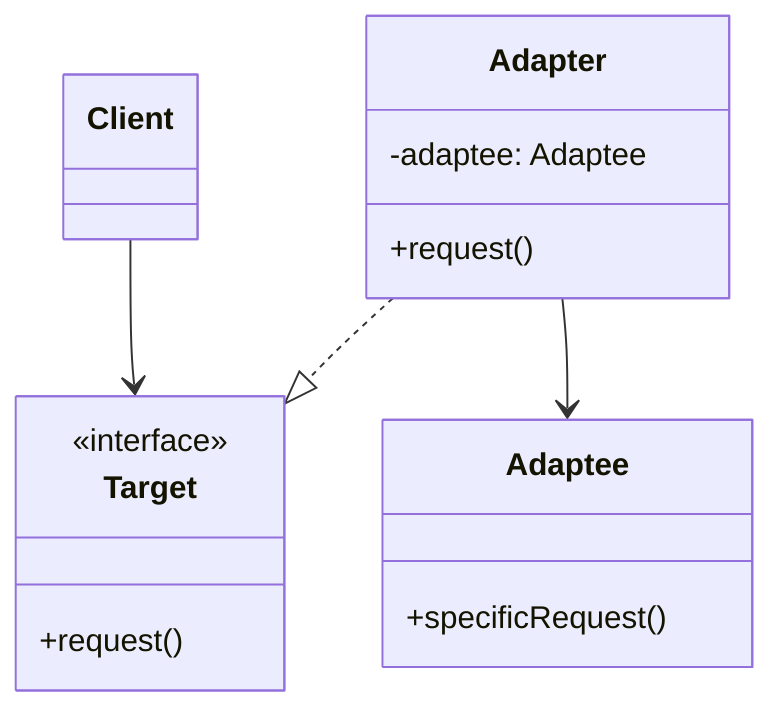

# The Adapter Design Pattern: A Comprehensive Guide

## 1. Definition and Purpose

The Adapter design pattern is a structural pattern that allows objects with incompatible interfaces to collaborate. It acts as a wrapper between two objects, converting the interface of one object so that another object can understand it.

The main purpose of the Adapter pattern is to:
- Allow the integration of new components into existing systems without modifying the source code
- Enable the reuse of existing functionality with new interfaces
- Provide a middle layer between different components to ensure they can work together seamlessly

## 2. When to Use the Adapter Pattern

Use the Adapter pattern when:

- You want to use an existing class, but its interface doesn't match the one you need
- You need to create a reusable class that cooperates with classes that don't necessarily have compatible interfaces
- You need to integrate a third-party library or legacy code into your application without modifying the original source
- You're working with multiple inherited interfaces and need to simplify the hierarchy

## 3. Structure of the Adapter Pattern

The Adapter pattern typically involves these components:

1. **Target**: The interface that the client expects to work with
2. **Adaptee**: The existing interface that needs to be adapted
3. **Adapter**: The class that bridges the gap between Target and Adaptee
4. **Client**: The class that interacts with the Target interface

Here's a diagram illustrating the structure:



## 4. Implementation Details

Let's examine the implementation using the provided code examples:

1. **Target Interface (Item)**:

```java
public interface Item {
    String getItemName();
    String getPrice();
    String getRestaurantName();
}
```

2. **Adaptee Interface (GroceryItem)**:

```java
public interface GroceryItem {
    String getName();
    String getPrice();
    String getStoreName();
}
```

3. **Adapter (GroceryItemAdapter)**:

```java
public class GroceryItemAdapter implements Item {
    private GroceryItem item;

    public GroceryItemAdapter(GroceryItem item) {
        this.item = item;
    }

    @Override
    public String getItemName() {
        return item.getName();
    }
    
    @Override
    public String getPrice() {
        return item.getPrice();
    }

    @Override
    public String getRestaurantName() {
        return item.getStoreName();
    }
}
```

4. **Client (ZomatoStore)**:

```java
import java.util.ArrayList;
import java.util.List;

public class ZomatoStore {
    List<Item> items = new ArrayList<>();

    public void addItem(Item item) {
        items.add(item);
    }
}
```

In this implementation, the `GroceryItemAdapter` allows `GroceryItem` objects to be used where `Item` objects are expected. The adapter translates method calls from the `Item` interface to the corresponding methods in the `GroceryItem` interface.

## 5. Advantages and Disadvantages

### Advantages:
- Increases reusability of existing code
- Improves interoperability between incompatible interfaces
- Follows the Single Responsibility Principle by separating interface conversion from the primary business logic
- Enhances flexibility by allowing the addition of new adapters without changing existing code

### Disadvantages:
- Increases overall code complexity by introducing new interfaces and classes
- Sometimes, it might be simpler to change the service class to match the rest of your code
- Can impact performance due to the additional layer of abstraction

## 6. Real-World Examples

1. **Power Adapters**: Different countries have different electrical outlet standards. Power adapters allow devices to be used in various countries without changing the device itself.

2. **Legacy System Integration**: When integrating a modern system with a legacy one, adapters can be used to translate between new and old data formats or protocols.

3. **Database Abstraction Layers**: ORMs (Object-Relational Mappers) often use the Adapter pattern to provide a consistent interface for different database systems.

## 7. Best Practices

1. **Keep it Simple**: Only adapt the methods that are actually needed.
2. **Consider Using Composition**: Favor composition over inheritance when implementing adapters.
3. **Use Interfaces**: Design to interfaces rather than concrete classes to increase flexibility.
4. **Document Adapters**: Clearly document the purpose and usage of each adapter.
5. **Unit Test Adapters**: Ensure that adapters correctly translate between interfaces.
6. **Consider Two-Way Adapters**: If necessary, implement adapters that can convert in both directions.

## 8. Common Pitfalls

1. **Overuse**: Don't use adapters when a simple refactor of the original code would suffice.
2. **Performance Overhead**: Be aware of potential performance impacts, especially in performance-critical sections.
3. **Complexity Creep**: Avoid creating "adapter chains" where multiple adapters are used in sequence.
4. **Ignoring Exception Handling**: Ensure that exceptions from the adaptee are properly handled and translated if necessary.

## 9. Variations of the Adapter Pattern

1. **Class Adapter**: Uses multiple inheritance to adapt one interface to another. (Note: This is not possible in Java, which doesn't support multiple inheritance of classes)
2. **Object Adapter**: Uses composition to adapt one interface to another. This is the approach used in the provided example.
3. **Two-Way Adapter**: Allows clients to work with both interfaces interchangeably.

## 10. Related Patterns

- **Bridge**: While the Adapter pattern is used to make unrelated classes work together, the Bridge pattern is used to separate an abstraction from its implementation so that the two can vary independently.
- **Decorator**: Adds responsibilities to objects without subclassing. Adapters change an object's interface, decorators enhance an object's responsibilities.
- **Proxy**: Provides a surrogate for another object to control access to it. Unlike Adapter, Proxy uses the same interface as its subject.
- **Facade**: Provides a simplified interface to a complex subsystem. An adapter changes the interface of an existing object, while a facade works with entire subsystems.

## Conclusion

The Adapter pattern is a powerful tool in a developer's toolkit for integrating incompatible interfaces and promoting code reuse. By understanding its structure, implementation details, and best practices, you can effectively use this pattern to create more flexible and maintainable software systems.

Remember, while the Adapter pattern can solve many integration problems, it's not a silver bullet. Always consider the specific needs of your project and the long-term maintainability of your code when deciding to implement this or any design pattern.